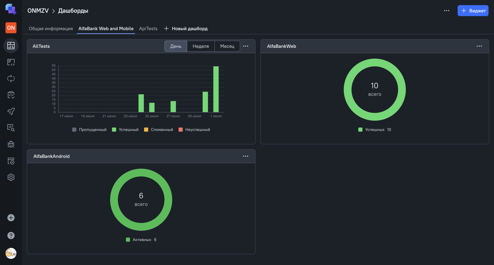

<a href="https://alfabank.ru/ ">  
<h1 >Проект по автоматизации тестирования для компании <a href="https://alfabank.ru/ "> Альфа-банк</a></h1> 

## ☑️ Содержание:

- [Технологии и инструменты](#технологии-и-инструменты)
- [Реализованные Web проверки](#реализованные-web-проверки)
- [Реализованные mobile Android проверки](#реализованные-mobile-android-проверки)
- [Сборка в Jenkins](#img-altjenkins-height25-srcmediajenkinssvg-width25-сборка-в-jenkins)
- [Параметры сборки в Jenkins](#параметры-сборки-в-jenkins)
- [Команды для запуска тестов](#команда-для-запуска-из-терминала)
- [Allure Report](#allure-report)
- [Allure TestOps](#allure-testops)
- [Уведомление в Telegram](#telegram)
- [Примеры видео выполнения web тестов](#web-video)
- [Примеры видео выполнения мобильных тестов](#browserstack-video-examples)

<a id="tools"></a>

## Технологии и инструменты:

<p align="center">
<a href="https://www.jetbrains.com/idea/">
<a href="https://www.java.com/ru/"> 
<a href="https://selenide.org/"> 
<a href="https://aerokube.com/selenoid/"> 
<a href="https://github.com/allure-framework/"> 
<a href="https://qameta.io/"> 
<a href="https://gradle.org/"> 
<a href="https://junit.org/"> 
<a href="https://github.com/"> 
<a href="https://www.jenkins.io/"> 
<a href="https://telegram.org/"> 
<a href="https://appium.io/docs/en/latest/"> 
<a href="https://developer.android.com/studio"> 
<a href="https://www.browserstack.com/"> 
</p>
<a id="cases"></a>

## Реализованные Web проверки:

- Проверка, что при наведении на меню "Частным лицам" открывается меню,
- Проверка наличия пункта "Кредиты" в меню,
- Проверка открытия страницы кредитный калькулятор,
- Проверка открытия страницы входа в личный кабинет,
- Проверка открытия страницы "Войти" и выбираем "Войти в Альфа-онлайн",
- Проверка открытия страницы "Стать клиентом",
- Открываем виджет поиска и проверяем, что нашлось значение qa.guru,
- Проверяем максимальную сумму кредита на странице Кредитный калькулятор,
- Проверяем отображения текста Госуслуги или справка о доходах если сумма кредита больше 300.000,
- Проверяем маску телефона на странице "Войти в Альфа-онлайн".

## Реализованные mobile Android проверки:

- Проверка тайтла на экране входа,
- Проверка, что кнопка зайти задизейблена если поле ввода не заполнено,
- Проверка, что у кнопки входа текст Зайти,
- Проверка ввода некорректного телефона и отображения ошибки,
- Проверка ввода некорректного иностранного телефона и отображения ошибки,
- Проверка ввода корректного номера и успешный вход.

##   Сборка в [Jenkins](https://jenkins.autotests.cloud/job/ONamozov_diplom_34/)

<p align="center">
<a href="https://jenkins.autotests.cloud/job/ONamozov_diplom_34">   
</p>


## Параметры сборки в Jenkins:

- Tag (Уникальный тэг тестов)
- browser (браузер, по умолчанию chrome)
- browserVersion (версия браузера, по умолчанию 127.0)
- browserSize (размер окна браузера, по умолчанию 1920x1080)

## Команда для запуска из терминала

Локальный запуск mobile Android тестов

```bash
gradle clean AlfaBankAndroidEmulation
```

Удаленный запуск mobile Android тестов

```bash
gradle clean android_browserstack
```

Локальный запуск для запуска Web тестов

```bash
gradle clean AlfaBankWeb
```

Локальный запуск всех тестов

```bash
gradle clean AllTests
```

Запуск с параметрами Web тестов:

```bash  
gradle clean AlfaBankWeb -Dbrowser=chrome -DbrowserSize=1920x1080 -DbrowserVersion=128.0
```

Удаленный запуск через Jenkins:

```bash  
clean
"${TAG}"
-Dbrowser="${BROWSER}"
-DbrowserSize="${BROWSER_SIZE}"
-DbrowserVersion="${BROWSER_VERSION}"
-DbrowserRemote="https://login:password@${BROWSER_REMOTE}/wd/hub"
```

## </a>  <a name="Allure"></a>Allure Report    </a>
<a id="allure-report"></a>
## Основная страница отчёта

<p align="center">  
<a href="https://jenkins.autotests.cloud/job/ONamozov_diplom_34">   
</p>  

## </a>  <a name="Allure TestOps"></a>Allure TestOps    </a>
<a id="allure-testops"></a>
## Основная страница отчёта Allure TestOps

<p align="center">  
<a href="https://allure.autotests.cloud/project/4783/launches">   
</p>  

## Список тест-кейсов

<p align="center">  
<a href="https://allure.autotests.cloud/project/4783/test-cases?treeId=0">   
</p>
<a id="telegram"></a>

## </a> Уведомление в Telegram при помощи бота

____
<p align="center">  
  
</p>

____
<a id="web-video"></a>
## </a> Примеры видео выполнения web тестов в Selenoid

____
<p align="center">
   
</p>

<p align="center">
   
</p>

<p align="center">
   
</p>

<a id="browserstack-video-examples"></a>
## </a> Примеры видео выполнения мобильных тестов в BrowserStack

____
<p align="center">
   
</p>

<p align="center">
   
</p>
